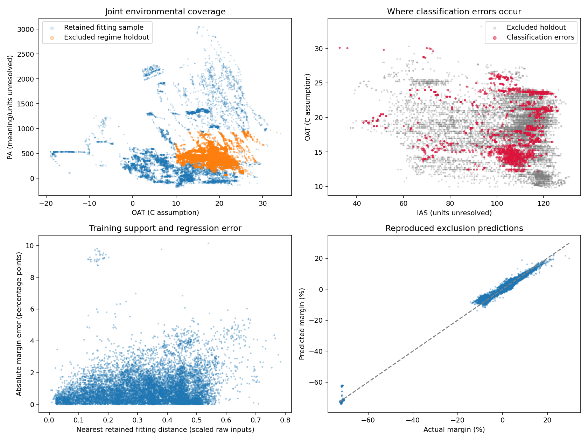

# Regime 5 investigation

The evidence supports a coverage-sensitive failure: the regime-exclusion refit loses
support for joint measurement combinations, and its errors concentrate within
particular portions of that excluded domain. Reducing the training sample by a similar
amount at random does not reproduce the degradation.

## Provenance and scope

The original harness saved aggregate stress-test metrics, but did not persist its
fitted stress clustering, stressed model or observation-level stress predictions.
The original experiment therefore cannot be recovered exactly from the supplied files.

This investigation is a new, instrumented reproduction using the supplied frozen
configuration and selected features. It contains 24,456 excluded-regime holdout rows,
compared with 24,485 in the original reported regime-5 test. Its fitting/calibration
counts are 433,407 / 57,828, compared with original counts 433,318 / 57,774.
Neither cluster membership nor predictions are claimed to be identical to the original.
See provenance.json. Cluster labels are arbitrary operating-condition identifiers,
not engine identities. All findings below refer to this reproduction unless stated.

No model/feature/threshold search used these evaluation outcomes. Normal calibration
and F2-threshold selection used the corresponding calibration partitions. A common
0.245-threshold comparison is supplied to distinguish threshold changes from refit effects.

## What the reproduced cluster represents

Stress clustering uses RobustScaler and MiniBatchKMeans on OAT, PA and IAS, fitted
exclusively on the original training partition. Membership is determined by the
nearest of all six stored centers in scaled three-dimensional space.

| Coordinate | Reproduced cluster-5 center |
|---|---:|
| OAT | 18.11956 |
| PA | 429.27833 |
| IAS | 102.86574 |

OAT in Celsius is an assumption inherited from the configuration. PA meaning/units
and IAS units remain unresolved. Do not interpret PA as confirmed altitude or IAS as
confirmed knots. The center describes location, not a hard rectangular boundary.

The reproduced cluster contains 164,465 observations across all experiment partitions.
regime5_measurements.csv exports all their raw measurements, targets and partition roles.
regime5_predictions.csv contains predictions and errors for the 24,456 final holdout rows.
stress_cluster_definition.json stores the scaler center/scale and all six scaled centers;
stress_cluster.joblib preserves the actual fitted clustering for future use.

## Same-observation comparison

The first three rows below evaluate exactly the same 24,456 observations. The main-model
predictions come from the uploaded holdout CSV. The random-removal control refits the
same frozen selected architecture on 433,500 fitting rows and 57,841 calibration rows,
sampled by whole duplicate groups while retaining data from every regime. Sizes are
approximately matched to the exclusion refit. Each model uses its own calibrated F2 threshold.

| Model | Accuracy | Fault recall | Missed faults | False alarms | Margin MAE, percentage points | 90% interval coverage |
|---|---:|---:|---:|---:|---:|---:|
| Main model, regime present during fitting | 99.87% | 99.81% | 11 | 20 | 0.443 | 92.38% |
| Random-removal control | 99.92% | 99.93% | 4 | 15 | 0.452 | 91.39% |
| Regime-5 exclusion refit | 92.26% | 89.31% | 617 | 1,275 | 1.044 | 62.17% |
| Original reported stress test, different membership possible | 90.95% | 89.70% | 606 | 1,610 | 0.970 | 64.35% |

With the common 0.245 threshold, fault recall is 99.81% for the main model,
99.90% for the random-removal control and 89.05% for the exclusion refit.
The degradation therefore remains after aligning the decision threshold.

This control supports missing condition coverage as an important explanation beyond
the mere reduction in sample size. It is one random-control seed, not a repeated
causal study. Fitting distributions, learned features and calibration also change.
The slightly better random-control accuracy is not evidence that random removal helps.

## Coverage evidence

Almost all excluded observations remain inside every raw measurement's retained
fitting min/max range. Only one NG measurement exceeds its retained range. Single-variable
range checks would therefore miss nearly all of this shift.

Nearest-neighbor distances use a fixed, reproducible 100,000-row sample of the retained
fitting data, with robust scaling fitted on all retained fitting rows. They are descriptive
support diagnostics, not physical distances or validated operational alert thresholds.

| Support diagnostic | OAT-PA-IAS space | All seven raw measurements |
|---|---:|---:|
| Median distance, retained holdout | 0.00499 | 0.04007 |
| Median distance, excluded regime holdout | 0.22905 | 0.33595 |
| Excluded observations above retained holdout's 95th-percentile distance | 96.95% | 90.24% |

The environmental distance is approximately 46 times larger at the median in the
excluded region. This is a joint-coverage gap despite ordinary marginal ranges.
In raw-input distance quintiles, fault recall falls from 96.72% in the nearest fifth
to 64.95% in the farthest fifth. Margin MAE rises from 0.796 to 1.337 percentage points.
Distance-error Spearman correlations are modest (0.176 for absolute regression error
and 0.148 for classification error), so distance alone does not explain every failure.

## Where missed faults concentrate

These are exploratory conditions within reproduced regime 5; they overlap and must
not be added together or interpreted as learned safety rules. Rows can include duplicates.

| Condition | Faulty rows | Missed by exclusion refit | Fault recall | Missed by main model on the same rows |
|---|---:|---:|---:|---:|
| OAT above 19 through 21.25 | 279 | 236 | 15.41% | 0 |
| PA above 533.0952 | 1,029 | 384 | 62.68% | 4 |
| IAS above 111.9375 | 1,618 | 410 | 74.66% | 0 |

The first condition contains 38.25% of all reproduced missed faults. The PA condition
contains 62.24%, and the IAS condition contains 66.45%; overlaps account for the total
exceeding 100%. Within the first condition, the model misses 84.59% of faults despite
overall accuracy in that bin being 94.56%, because healthy observations dominate.

False alarms concentrate differently: OAT above 14 through 17.25 contains 592 of
1,275 false alarms (46.43%). Measured torque above 70.4 through 75 contains 717
false alarms (56.24%); these conditions also overlap.

Of the 617 missed faults, 479 receive a predicted fault probability below 0.01.
Approximately 84.28% of missed faults have a positive true torque margin. A rule based
only on negative torque margin would not fix these failures.

## Interpretation and limits

Both requested explanations are supported: failure rates concentrate in particular
measurement ranges, and deliberate removal of their joint operating region creates
missing fitting/calibration coverage. The normal full model had examples from this
regime and performs well on these rows. This does not establish that its existing
training data lack regime-5 coverage.

Hidden engine identity may confound the associations. OAT, PA and IAS bands can act
as engine or flight-profile fingerprints. No physical failure mechanism or unseen-engine
performance is established. Labels, units and cluster geometry should be reviewed with
engineering stakeholders before attaching a flight-condition interpretation.

The holdout has now been inspected diagnostically. Use these findings to design grouped
development experiments, then assess improvements on a fresh independent engine dataset.
Priorities are broader representative coverage, conditional uncertainty calibration,
and validated novelty/review policies. Simply lowering the classification threshold
cannot repair inaccurate probabilities and under-covered margin distributions.

## Export guide

- regime5_measurements.csv: all 164,465 reproduced cluster members with raw measurements,
  true labels, duplicate-group keys and original partition roles.
- regime5_predictions.csv: 24,456 evaluation rows with raw measurements, stressed and main
  predictions, intervals, classification errors, regression errors and training-support distances.
- false_negatives.csv / classification_errors.csv: review-ready error subsets.
- largest_margin_errors.csv: 200 largest absolute regression errors.
- condition_error_rates.csv / focused_condition_errors.csv: concentrations with denominators.
- coverage_ranges.csv / coverage_neighbors.json: marginal and joint support evidence.
- all_cluster_centers.csv / stress_cluster_definition.json / stress_cluster.joblib:
  interpretable geometry and the actual frozen reproduced cluster.
- cluster_membership.csv: all 742,625 observation IDs and reproduced cluster assignments.
- reproduced_stress_model.joblib / random_removal_control.joblib: frozen refit artifacts.
- metric_comparison.csv / fixed_threshold_comparison.csv: matched-observation comparisons.
- provenance.json / verification.json: scope, reproduction discrepancy and integrity checks.
